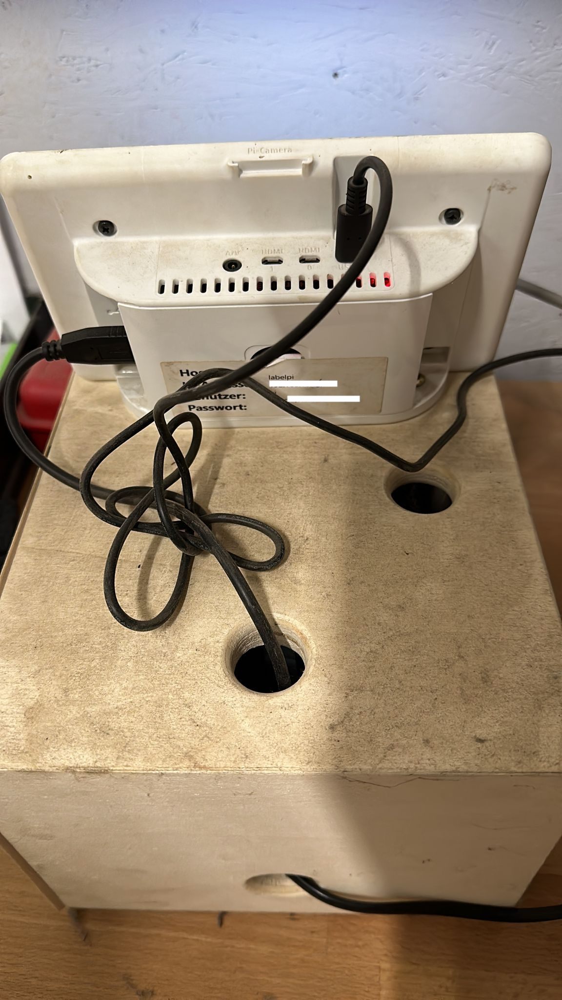

<div align="center">
  
  
  

  # LabelPi
</div>

CUPS container for setting up an AirPrint server on armhf machines like the Raspberry Pi.

## Usage
This project exists because one of my customers was looking for a solution to quickly digitalize their delivery slips.
- The user enters the number of the delivery slip
- LabelPi connects to a database where all the information about the delivery slip is being stored
- From the data a barcode gets generated
- A label with a QR code is printed and then should be put on the paper document
- The document gets scanned and can be archived

## Requirements 
### Prepare The Raspberry Pi
Make sure you've got a Raspberry Pi or some other kind of armhf machine, a compatible touch screen (required to take the user input) and a printer. Raspberry Pi OS provides touchscreen drivers so if you already have a Raspberry Pi at home, just buy an external touch display and you're good to go. 

On your Raspberry Pi prepare it with the following steps:
- Install Raspberry Pi OS
Choose the version you prefer. You can follow this tutorial with both versions. The full version allows you to access CUPS in local, so it may be faster.
- Update your system
  Open a terminal and execute the following commands:
  ```sh
  sudo apt update
  ```
  ```sh
  sudo apt upgrade
  ```
- Enable SSH if you want to follow this tutorial from your computer
    ```sh
  sudo service ssh start
  ```

### Get The Printer Ready For Installation
Next step is to install the printer on your Raspberry Pi. Before anything else, you have to collect all the needed information and prepare it for the installation:
- For a USB Printer
  - Turn the printer ON
  - Plug it into your Raspberry Pi
- For a Network Printer:
  - Turn the printer ON
  - Make sure the printer is available on the network
  - You can check this on your computer
- In any case, take note of the manufacturer and the exact model, to install the driver later

### Install CUPS on Raspberry Pi
CUPS, shorthand for Common Unix Printing System, is the go-to server tool for managing access to printers that need to be shared with multiple users on a network. Required steps to install a printer with CUPS on a Raspberry Pi:
- Install the “cups” application with the package manager
- Allow remote access to the CUPS web interface
- Use the web interface to install the new printer

We’ll now see how to do this in detail, but first, let’s start with a brief introduction to this tool

### Configuration file
Edit the config.ini file and provide it with some basic configuration data.

| Type           | Parameter           | Description                                 |
|----------------|---------------------|---------------------------------------------|
| DB config      | server              | Server                                      |
|                | port                | Port                                        |
|                | password            | Password                                    |
|                | database            | Name of the db schema                       |
|                | named_instance      | Boolean flag                                |
|                | named_instance_name | Name of the instance                        | 
|                |                     |                                             |
| Style config   | activation_style    | Name of the folder containing the css file  |
|                |                     |                                             |
| Printer config | printer_name        | Name of the printer                         |
|                | page_height         | Height of the page in floating point number |
|                | page_width          | Height of the page in floating point number |

## Starting the program
Just execute start.sh :)

## Photos
Physical setup. Printer and Pi are stored in a wooden box with the touch screen placed on top of it.

